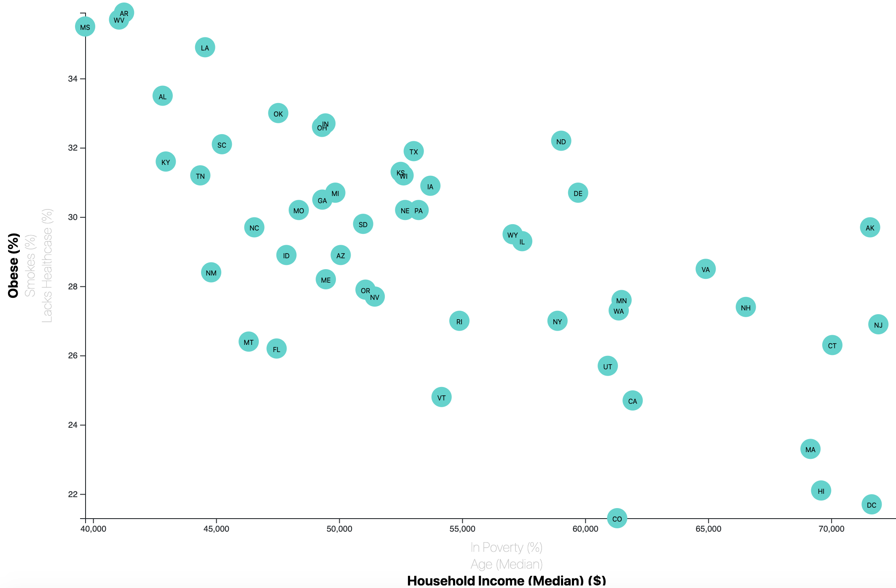

### Purpose of this project:
The purpose of this project is to analyze the health risks facing particular demographics. Specifically, this project looks to see if poverty, age, and household income has any correlation to obesity, smoking, and lack of healthcare. To make it easy for readers to understand the findings, all the data is compiled into one interactive graph where users can pick and choose which paring of variables to view.

---

### How to run the code:
**First Option**
1. Save all files of repository (except the files in the screenshots folder) to a folder on your computer.
1. Open your terminal.
1. cd into the folder your saved the files in.
1. Run the command “python -m http.server”.
1. Copy the server listed in the response (ex. http://0.0.0.0:8000/)
1. Paste the server in your browser OR type "localhost:8000" in your browser.
1. Pick and choose any combination of x and y axes to see the relationships between the variables.
<!-- end of the list -->
**Second Option:**
1. View page from Github Pages at: [https://sfroonjian.github.io/D3-challenge/](https://sfroonjian.github.io/D3-challenge/)

---

### Data collected:

---

### Why the data is displayed this way:
The data is displayed this way because it creates a more interactive webpage. Users can choose from 3 independent variable and 3 dependent variables to see a total of 9 different combinations of data all within the same graph. Each data point also has an abbreviation inside of it to illustrate which state it represents, and a pop up with the exact data values of each data point appears every time you hover over each data point. Both of these features makes it even easier for users to understand the results.
